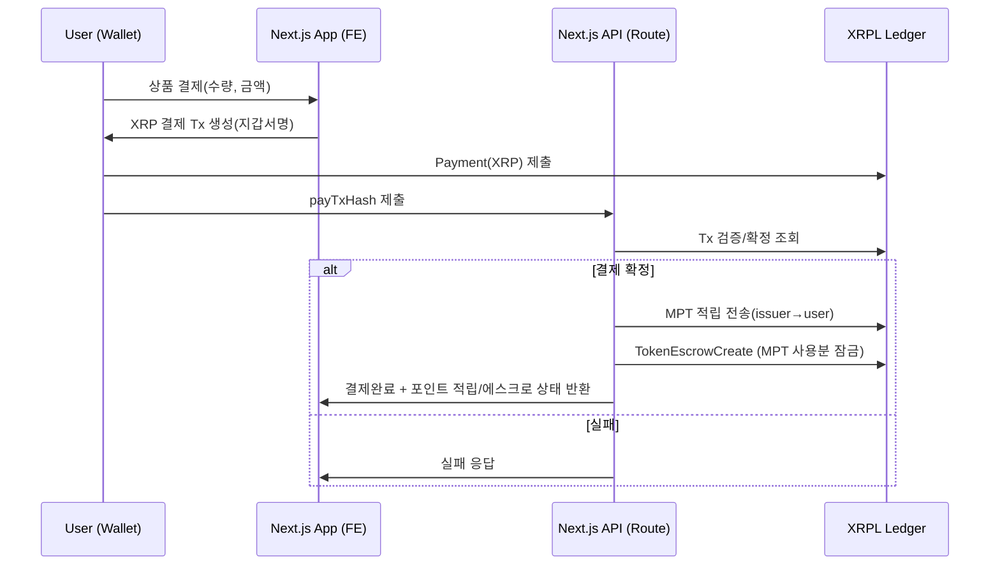

# 🚀 XRPL Web3 Payment System

XRPL 기반 Web3 결제 시스템으로, 사용자, 기업, 관리자 역할을 지원하며 MPT 포인트 시스템과 NFT 저작권 보호 기능을 제공합니다.

## 🌟 주요 기능

- **🔐 다중 역할 시스템**: USER, COMPANY, ADMIN
- **💰 MPT 포인트 시스템**: 구매 시 포인트 적립 및 사용
- **🎨 NFT 저작권 보호**: 게시글 NFT 발행 및 라이선스 관리
- **🎁 기부 시스템**: XRP 및 MPT로 게시글 기부
- **🛍️ 상품 거래**: 기업의 상품 판매 및 구매
- **📋 구독 서비스**: 기업용 Pro/Enterprise 플랜
- **🔒 블록체인 기반**: XRPL을 통한 투명한 거래

## 🏗️ 시스템 아키텍처



## 🛠️ 기술 스택

- **Frontend**: Next.js 15, TypeScript, Tailwind CSS
- **Backend**: Next.js API Routes
- **Database**: SQLite with Prisma ORM
- **Blockchain**: XRPL (XRP Ledger)
- **Authentication**: JWT
- **File Storage**: Local file system

## 🚀 빠른 시작

### 1. 프로젝트 클론 및 의존성 설치

```bash
git clone <repository-url>
cd xrpl-alld
npm install
```

### 2. 환경변수 설정

```bash
cp .env.example .env.local
```

`.env.local` 파일을 편집하여 다음 값들을 설정:

```
DATABASE_URL="file:./dev.db"
XRPL_RPC_URL="wss://s.altnet.rippletest.net:51233"
JWT_SECRET="your_jwt_secret_here"
NEXT_PUBLIC_BASE_URL="http://localhost:3000"
```

### 3. 데이터베이스 초기화

```bash
npx prisma db push
npx prisma generate
```

### 4. 개발 서버 실행

```bash
npm run dev
```

### 5. 시스템 초기화

관리자 계정과 MPT 발행을 위해 다음 API를 호출:

```bash
curl -X POST http://localhost:3000/api/admin/init \
  -H "Content-Type: application/json" \
  -d '{
    "adminEmail": "admin@example.com",
    "adminPassword": "admin123",
    "adminDisplayName": "System Admin"
  }'
```

## 📚 API 문서

자세한 API 문서는 [API_DOCUMENTATION.md](./API_DOCUMENTATION.md)를 참조하세요.

### 주요 API 엔드포인트

- **인증**: `/api/auth/signup`, `/api/auth/login`
- **게시글**: `/api/posts`
- **NFT**: `/api/posts/{postId}/nft`, `/api/nft`
- **기부**: `/api/posts/{postId}/donate`
- **상품**: `/api/products`
- **주문**: `/api/orders`
- **구독**: `/api/subscriptions`

## 🔐 사용자 역할

### USER (일반 사용자)
- 게시글 작성 및 NFT 발행
- 다른 게시글에 기부
- 상품 구매 및 포인트 사용
- 개인 지갑 관리

### COMPANY (기업 사용자)
- 상품 등록 및 판매
- 구독 서비스 이용
- 기업 지갑으로 기부
- 회사 인증 신청

### ADMIN (관리자)
- 시스템 전체 관리
- 회사 승인/거부
- MPT 토큰 발행 관리
- 전체 통계 조회

## 💰 경제 시스템

### MPT 포인트 시스템
- **적립률**: 구매 금액의 5%
- **잠금 기간**: 환불 가능 기간 동안 에스크로
- **사용처**: 상품 구매, 기부

### 기부 시스템
- **XRP 기부**: 직접 XRP 전송
- **MPT 기부**: 포인트를 통한 기부
- **투명성**: 모든 기부 내역 공개

## 🎨 NFT 저작권 보호

### 저작권 검증
- 컨텐츠 해시 기반 중복 검사
- 유사도 계산 (Jaccard 계수)
- 70% 이상 유사 시 발행 차단

### NFT 기능
- 게시글 NFT 발행
- 소유권 이전
- 라이선스 생성 및 관리
- 저작권 증명서 발급

## 🛡️ 보안 기능

- **지갑 보안**: 암호화된 시드 저장
- **트랜잭션 검증**: XRPL 블록체인 확인
- **권한 관리**: JWT 기반 인증
- **감사 로그**: 모든 중요 작업 기록

## 🔧 개발 도구

### 데이터베이스 관리
```bash
npx prisma studio  # 데이터베이스 GUI
npx prisma migrate dev  # 스키마 변경
```

### 코드 품질
```bash
npm run lint  # ESLint 검사
npm run type-check  # TypeScript 검사
```

## 📈 모니터링 및 로깅

- 모든 XRPL 트랜잭션 로그 기록
- API 요청/응답 로깅
- 에러 추적 및 디버깅

## 🚦 환경 설정

### 개발 환경
- XRPL Testnet 사용
- 로컬 SQLite 데이터베이스
- 개발용 JWT 시크릿

### 프로덕션 환경
- XRPL Mainnet 권장
- PostgreSQL/MySQL 권장
- 강력한 JWT 시크릿 필수

## 🤝 기여하기

1. Fork the repository
2. Create your feature branch (`git checkout -b feature/amazing-feature`)
3. Commit your changes (`git commit -m 'Add some amazing feature'`)
4. Push to the branch (`git push origin feature/amazing-feature`)
5. Open a Pull Request

## 📄 라이선스

This project is licensed under the MIT License - see the [LICENSE](LICENSE) file for details.

## 🆘 문제 해결

### 자주 발생하는 문제

1. **XRPL 연결 오류**: RPC URL 확인
2. **트랜잭션 실패**: 지갑 잔액 및 네트워크 상태 확인
3. **JWT 토큰 오류**: 토큰 만료 또는 시크릿 불일치
4. **데이터베이스 오류**: Prisma 스키마 동기화 확인

### 지원

- GitHub Issues: 버그 리포트 및 기능 요청
- 개발자 문서: [API_DOCUMENTATION.md](./API_DOCUMENTATION.md)

---

> 💡 **참고**: 이 프로젝트는 해커톤 제출용으로 개발되었으며, XRPL Testnet을 사용합니다.