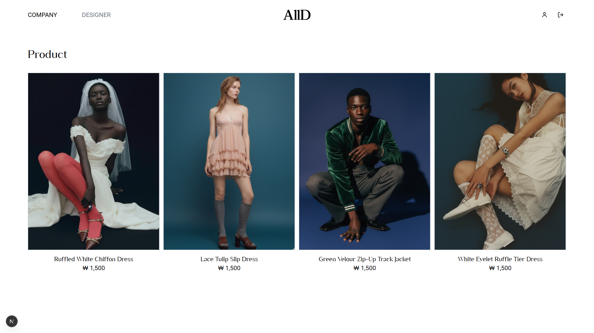
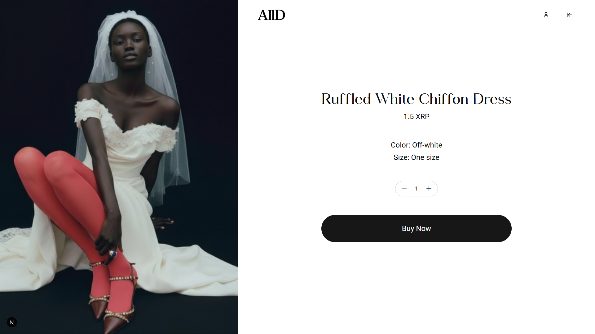
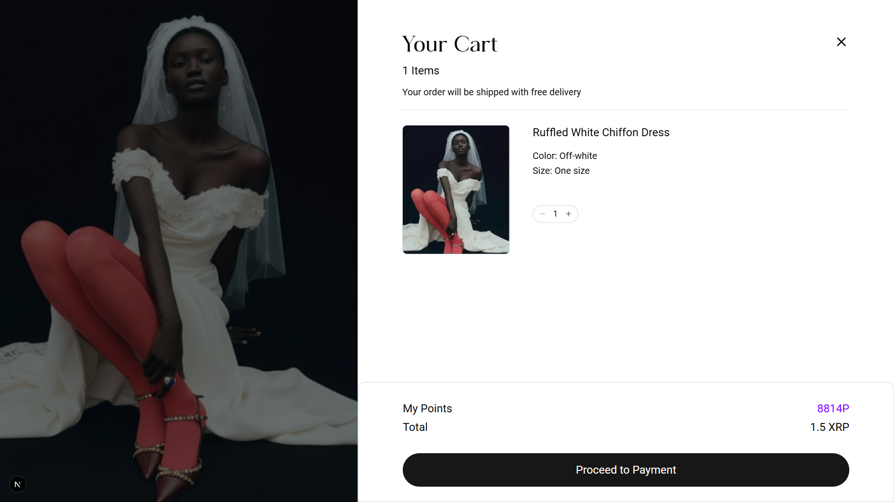
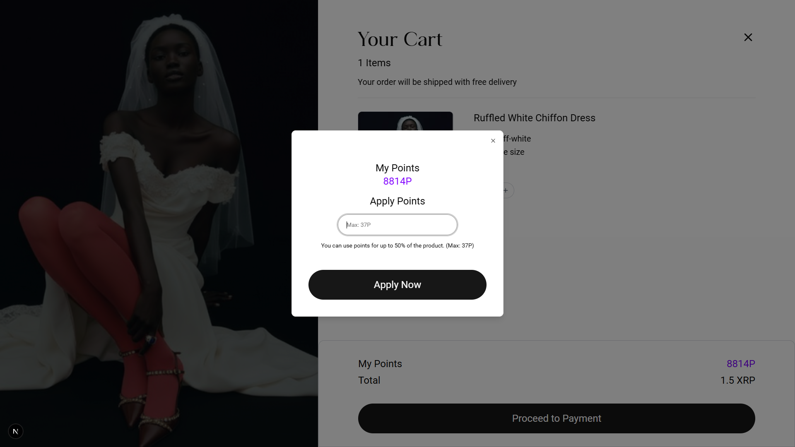
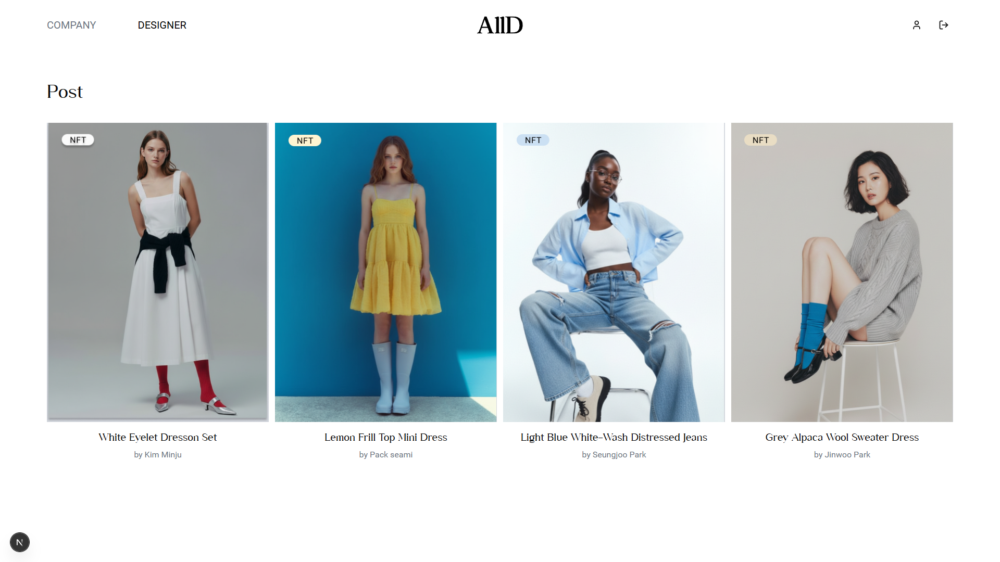
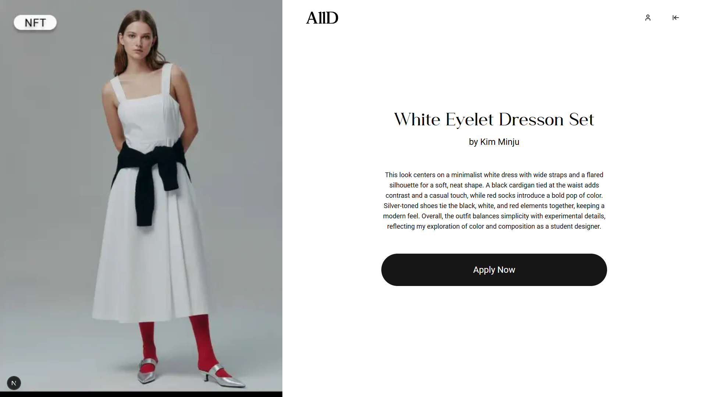
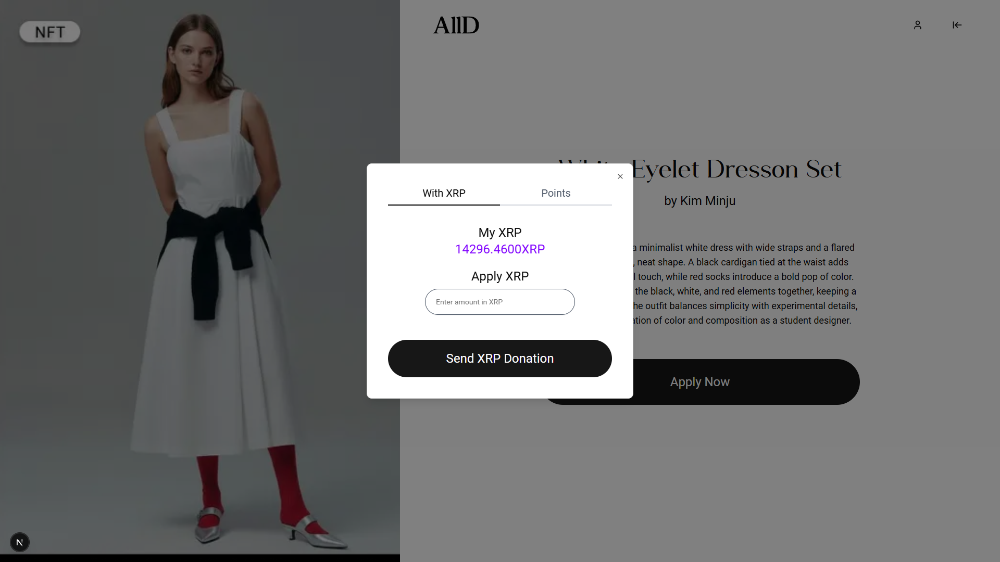
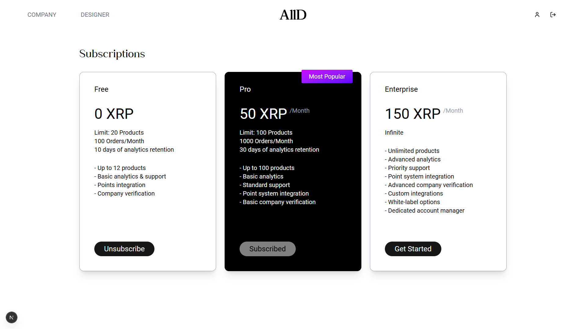
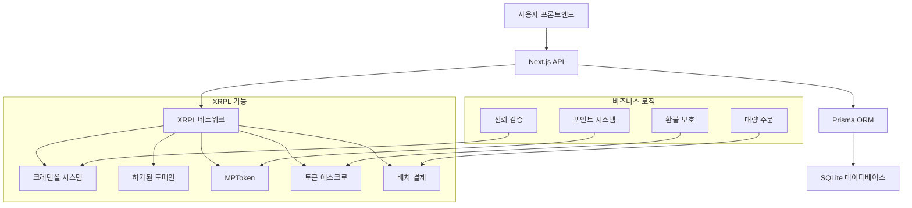

# AllD - XRPL 기반 Web3 이커머스 플랫폼

XRPL 기반의 종합 Web3 이커머스 플랫폼으로, MPT 기반 포인트 시스템, 크레덴셜 기반 신뢰 검증, 고급 배치 결제 기능을 제공합니다.

## 🎥 프로젝트 데모

- https://youtu.be/yOAkZAWKap4

## 📱 UI 스크린샷

### 사용자 인터페이스

## 🔧 XRPL 기술 구현

### 1. **Credential (크레덴셜)**
**구현 내용**: 기업 신뢰 검증 시스템
- **구현 파일**: `lib/credential.ts`, `lib/CredentialAccept.ts`
- **활용 사례**:
  - 검증된 기업에게 "AllD" 타입 크레덴셜 발급
  - 블록체인 기반 검증을 통한 상품 신뢰도 향상
  - 고객이 인증된 비즈니스를 식별할 수 있도록 지원
  - 기업 등록 시 크레덴셜 검증 요구로 사기 방지

### 2. **PermissionedDomain (허가된 도메인)**
**구현 내용**: 관리자 도메인 관리
- **구현 파일**: `lib/permissionedDomain.ts`
- **활용 사례**:
  - 관리자 지갑을 인증된 도메인으로 설정
  - "AllD" 크레덴셜을 수락하는 허가된 도메인 생성
  - 시스템 전체 크레덴셜 검증을 위한 중앙 권한 확립
  - 승인된 주체만 크레덴셜 발급 및 검증 가능하도록 보장

### 3. **MPTokenV1 (MPT 토큰)**
**구현 내용**: 포인트 시스템 및 후원 기능
- **구현 파일**: `lib/createIssuance.ts`, `lib/sendMpt.ts`, `lib/donation.ts`
- **활용 사례**:
  - **포인트 적립**: 구매 금액의 5%를 MPT 토큰으로 캐시백
  - **포인트 사용**: 누적된 포인트로 상품 할인 구매
  - **후원 시스템**: 사용자가 콘텐츠 제작자에게 MPT 포인트 후원 가능
  - 
### 4. **TokenEscrow (토큰 에스크로)**
**구현 내용**: 조건부 포인트 잠금/해제 시스템
- **구현 파일**: `lib/escrow.ts`, `app/api/orders/route.ts`에 통합
- **활용 사례**:
  - **구매 에스크로**: 환불 기간 동안 적립 포인트 잠금
  - **사용 에스크로**: 환불 보호를 위한 사용 포인트 임시 잠금
  - **자동 해제**: 환불 기간 만료 후 포인트 자동 잠금 해제
  - **환불 보호**: 주문 환불 시 포인트 회수 가능
  - **신뢰 구축**: 구매자와 판매자 모두에게 보안 제공

### 5. **Batch (배치 트랜잭션)**
**구현 내용**: 다중 상품 주문 시스템
- **구현 파일**: `lib/batchPayment.ts`, `app/api/orders/route.ts`
- **활용 사례**:
  - **대량 주문**: 단일 트랜잭션으로 여러 상품 주문 처리
  - **다중 판매자 결제**: 서로 다른 기업 지갑으로 개별 결제 전송
  - **가스 최적화**: 다중 구매 시 트랜잭션 수수료 절감
  - **원자적 트랜잭션**: AllOrNothing 플래그로 전체 성공/실패 보장
  - **향상된 UX**: 여러 아이템에 대한 간소화된 체크아웃 프로세스

## 🎬 기술 설명 영상
- https://youtu.be/_D6BlibWHNE (프로젝트 설명)  
- https://youtu.be/40y2xugC0G8 (코드 및 트랜잭션 로그 리뷰)

## 🏗️ 시스템 아키텍처

## 🔐 사용자 역할

### 일반 사용자 (USER)
- MPT 포인트로 상품 구매
- 콘텐츠 생성 및 후원 수령
- 개인 지갑 관리
- 주문 이력 추적

### 기업 사용자 (COMPANY)
- 상품 등록 및 관리
- 크레덴셜 기반 신뢰 검증
- 수익 추적 및 분석
- 배치 주문 처리

### 관리자 (ADMIN)
- 시스템 전체 관리
- 크레덴셜 발급 및 검증
- MPT 토큰 관리
- 플랫폼 분석 및 모니터링

## 🛠️ 기술 스택

- **프론트엔드**: Next.js 15, TypeScript, Tailwind CSS
- **백엔드**: Next.js API Routes
- **데이터베이스**: Prisma ORM을 사용한 SQLite
- **블록체인**: XRPL (XRP Ledger)
- **인증**: JWT
- **파일 저장소**: 로컬 파일시스템

## 📊 주요 기능

- **🔐 크레덴셜 기반 신뢰**: 검증된 기업 인증
- **💰 MPT 포인트 시스템**: 블록체인 기반 로열티 리워드
- **🔒 에스크로 보호**: 안전한 환불 및 분쟁 처리
- **⚡ 배치 처리**: 효율적인 다중 판매자 트랜잭션
- **🎁 후원 시스템**: MPT 포인트를 통한 제작자 지원
- **📈 분석 대시보드**: 실시간 트랜잭션 모니터링

---

> 💡 **참고**: 이 프로젝트는 해커톤 제출용으로 개발되었으며, 데모 목적으로 XRPL Devnet을 사용합니다.