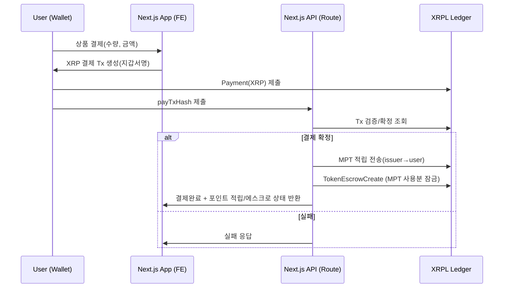

```mermaid
sequenceDiagram
  participant U as User (Wallet)
  participant FE as Next.js App (FE)
  participant BE as Next.js API (Route)
  participant XRPL as XRPL Ledger

  U->>FE: 상품 결제(수량, 금액)
  FE->>U: XRP 결제 Tx 생성(지갑서명)
  U->>XRPL: Payment(XRP) 제출
  U->>BE: payTxHash 제출
  BE->>XRPL: Tx 검증/확정 조회
  alt 결제 확정
    BE->>XRPL: MPT 적립 전송(issuer→user)
    BE->>XRPL: TokenEscrowCreate (MPT 사용분 잠금)
    BE->>FE: 결제완료 + 포인트 적립/에스크로 상태 반환
  else 실패
    BE->>FE: 실패 응답
  end

```